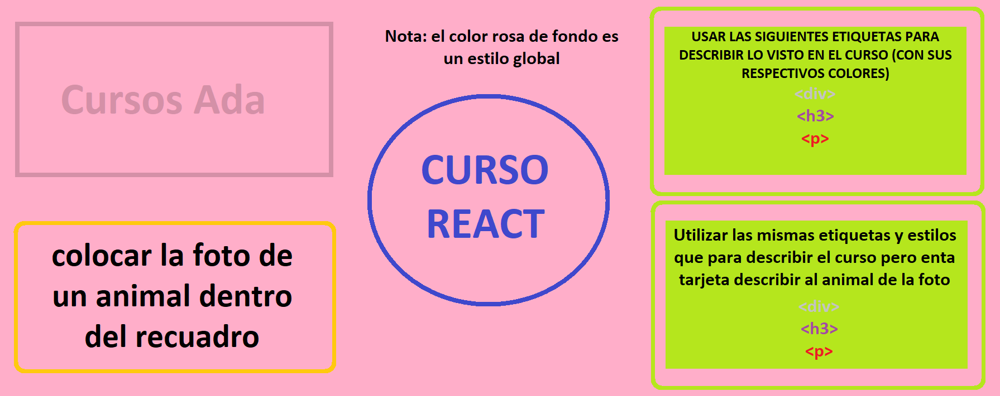

# Introduccion a estilos con react

## Contenido:

Ademas de la forma de añadir estilos que conocemos, y que el mismo react nos trae por defecto vamos a ver 4 formas mas.

En clase veremos los pros y contras de cada una de las formas sabiendo que se puede usar cualquiera.

1. cssStylesheet
2. inlineStyling
3. cssModules
4. styledComponents

en App estan comentados las 4 formas de importar los archivos para que se vean la diferencia.

en dentro de ./src/styles hay 4 carpetas para las formas de estilos que veremos, y dentro de cada una de ella hay:
1. package-lock.json
2. package.json
3. webpack.config.js

estos archivos son para el caso de que uno empiece un archivo de cero sin usar vite o npx create react.

## Contenido:
imitar esta imagen pero en react

Letra:
- Calibri

colores: 
- fondo: #FFAEC9
- cursos ada: #D490A7
- recuadro de la foto del animal: #FFC90E
- Curso React: #3F48CC

fondo verde:
- fondo verde #B5E61D
- texto: #000000
- 
 #BCC9C3
- <h3>#A34990
- 
 #ED1C24

